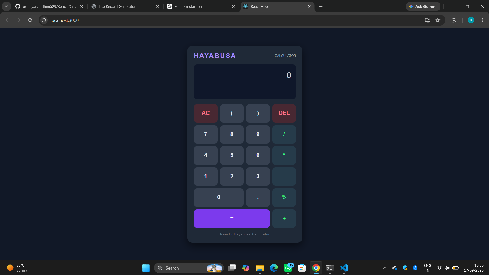

# Ex04 Simple Calculator - React Project
## Date:14-03-2026
## Name : 
## Reg No :

## AIM
To  develop a Simple Calculator using React.js with clean and responsive design, ensuring a smooth user experience across different screen sizes.

## ALGORITHM
### STEP 1
Create a React App.

### STEP 2
Open a terminal and run:
  <ul><li>npx create-react-app simple-calculator</li>
  <li>cd simple-calculator</li>
  <li>npm start</li></ul>

### STEP 3
Inside the src/ folder, create a new file Calculator.js and define the basic structure.

### STEP 4
Plan the UI: Display screen, number buttons (0-9), operators (+, -, *, /), clear (C), and equal (=).

### STEP 5
Create a new file Calculator.css in src/ and add the styling.

### STEP 6
Open src/App.js and modify it.

### STEP 7
Start the development server.
  npm start

### STEP 8
Open http://localhost:3000/ in the browser.

### STEP 9
Test the calculator by entering numbers and operations.

### STEP 10
Fix styling issues and refine content placement.

### STEP 11
Deploy the website.

### STEP 12
Upload to GitHub Pages for free hosting.

## PROGRAM

app.js
```

import { useState } from "react";
import "./App.css";

function App() {
  const [input, setInput] = useState("");
  const [result, setResult] = useState("");

  const handleClick = (value) => {
    if (value === "=") {
      calculate();
    } else if (value === "AC") {
      setInput("");
      setResult("");
    } else if (value === "DEL") {
      setInput((prev) => prev.slice(0, -1));
    } else {
      setInput((prev) => prev + value);
      setResult("");
    }
  };

  const calculate = () => {
    try {
      if (!input) return;

      const answer = eval(input);
      setResult(answer);
    } catch {
      setResult("Error");
    }
  };

  const buttons = [
    "AC", "(", ")", "DEL",
    "7", "8", "9", "/",
    "4", "5", "6", "*",
    "1", "2", "3", "-",
    "0", ".", "%", "=",
    "+"
  ];

  return (
    <div className="app">
      <div className="calculator">

        <div className="calculator-header">
          <span className="brand">HAYABUSA</span>
          <span className="mini-text">CALCULATOR</span>
        </div>

        <div className="display">
          <div className="expression">
            {input || "0"}
          </div>

          <div className="answer">
            {result !== "" ? `= ${result}` : ""}
          </div>
        </div>

        <div className="buttons">
          {buttons.map((button) => (
            <button
              key={button}
              onClick={() => handleClick(button)}
              className={`
                ${button === "=" ? "equals" : ""}
                ${["+", "-", "*", "/", "%"].includes(button)
                  ? "operator"
                  : ""}
                ${["AC", "DEL"].includes(button)
                  ? "special"
                  : ""}
                ${button === "0" ? "zero" : ""}
              `}
            >
              {button}
            </button>
          ))}
        </div>

        <div className="footer">
          React • Hayabusa Calculator
        </div>

      </div>
    </div>
  );
}

export default App;
```
app.css
```

* {
  margin: 0;
  padding: 0;
  box-sizing: border-box;
}

body {
  font-family: Arial, sans-serif;
}

/* Main page */

.app {
  min-height: 100vh;
  display: flex;
  justify-content: center;
  align-items: center;
  padding: 20px;

  background: #111827;
}

/* Calculator */

.calculator {
  width: 360px;
  padding: 20px;

  background: #1f2937;
  border-radius: 15px;

  box-shadow: 0 10px 25px rgba(0, 0, 0, 0.5);
}

/* Header */

.calculator-header {
  display: flex;
  justify-content: space-between;
  align-items: center;

  margin-bottom: 15px;
}

.brand {
  font-size: 20px;
  font-weight: bold;
  letter-spacing: 3px;
  color: #a78bfa;
}

.mini-text {
  font-size: 10px;
  color: #9ca3af;
}

/* Display */

.display {
  min-height: 110px;
  padding: 15px;
  margin-bottom: 15px;

  background: #0f172a;
  border-radius: 10px;

  display: flex;
  flex-direction: column;
  justify-content: center;
  align-items: flex-end;

  overflow: hidden;
}

.expression {
  width: 100%;

  text-align: right;
  color: #d1d5db;

  font-size: 24px;

  overflow-x: auto;
  white-space: nowrap;
}

.answer {
  color: #a78bfa;

  font-size: 30px;
  font-weight: bold;

  margin-top: 5px;
  min-height: 35px;
}

/* Buttons */

.buttons {
  display: grid;
  grid-template-columns: repeat(4, 1fr);
  gap: 8px;
}

button {
  height: 58px;

  border: none;
  border-radius: 10px;

  font-size: 18px;
  font-weight: bold;

  color: #e5e7eb;
  background: #374151;

  cursor: pointer;
}

button:hover {
  background: #4b5563;
}

button:active {
  transform: scale(0.95);
}

/* Operators */

.operator {
  color: #38f885;
  background: #263b4a;
}

.operator:hover {
  background: #31536a;
}

/* AC and Delete */

.special {
  color: #fb7185;
  background: #482832;
}

.special:hover {
  background: #633541;
}

/* Equal button */

.equals {
  grid-column: span 3;

  color: white;
  background: #7c3aed;
}

.equals:hover {
  background: #f4259a;
}

/* Zero */

.zero {
  grid-column: span 2;
}

/* Footer */

.footer {
  text-align: center;

  margin-top: 15px;

  font-size: 10px;
  letter-spacing: 1px;

  color: #6b7280;
}

/* Mobile */

@media (max-width: 450px) {

  .calculator {
    width: 100%;
    max-width: 360px;
    padding: 15px;
  }

  button {
    height: 55px;
  }

  .display {
    min-height: 100px;
  }

  .expression {
    font-size: 21px;
  }

  .answer {
    font-size: 27px;
  }
}
```

## OUTPUT



## RESULT
The program for developing a simple calculator in React.js is executed successfully.
